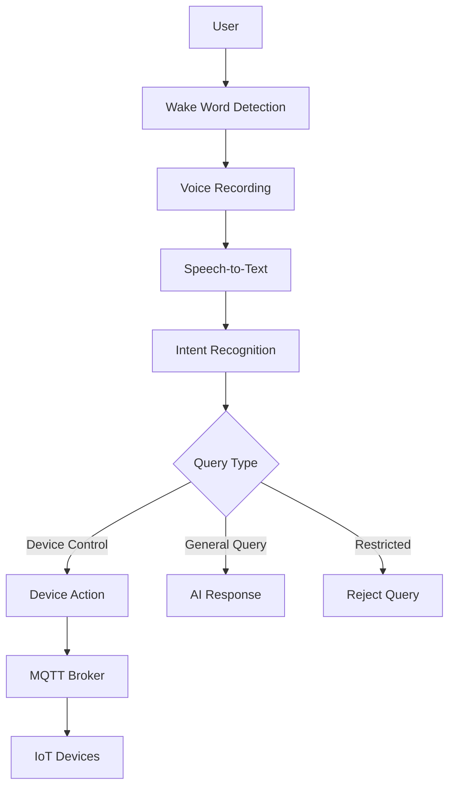

# 🤖 IoT Agent: Building a Voice-Controlled Smart Home Assistant

## Introduction

Imagine walking into your home and simply saying "Hey Jarvis, turn on the bedroom light" - and the light obediently illuminates your space. This is not science fiction anymore. The IoT Agent project brings this vision to life by combining cutting-edge AI technologies to create a sophisticated voice-controlled smart home assistant.

In this comprehensive guide, we'll explore how this project works, from wake word detection to device control, and understand the architecture that makes it all possible.

## What is the IoT Agent?

The IoT Agent is a Python-based smart home assistant that uses natural language processing to understand voice commands and control IoT devices. It's designed to be:

- **Voice-Activated**: Responds to custom wake words like "Hey Jarvis", "Alexa", or "Hey Google"
- **AI-Powered**: Uses Google Gemini AI to understand user intent
- **Device-Agnostic**: Controls any IoT device through MQTT protocol
- **Extensible**: Easy to add new devices and capabilities

## Architecture Overview

The system follows a modular architecture with clear separation of concerns:



## Core Components

### 1. Wake Word Detection

The first step in the interaction flow is wake word detection. The system uses Porcupine, a highly accurate wake word detection engine:

```python
# Listen for wake words using Porcupine
await listen_for_wake_word(on_detected=handle_wakeword)
```

**Key Features:**
- Uses pre-trained models for multiple wake words (jarvis, alexa, hey google, etc.)
- Low false positive rate with high accuracy
- Real-time processing with minimal latency
- Customizable wake words

The wake word detector runs continuously in the background, listening for activation phrases. When detected, it triggers the main workflow.

### 2. Speech Recognition

Once activated, the system captures and transcribes user commands:

```python
def transcribe_audio():
    with sr.Microphone() as source:
        recognizer.adjust_for_ambient_noise(source)
        play_chime()  # Audio feedback to start speaking
        audio = recognizer.listen(source, timeout=2)
    return recognizer.recognize_google(audio)
```

**Process:**
1. Adjusts for ambient noise to improve accuracy
2. Plays a chime sound to indicate it's listening
3. Captures audio with a 2-second timeout
4. Uses Google's Speech Recognition API for transcription

### 3. Intent Recognition

This is where the AI magic happens. The system uses Google Gemini AI to classify the user's query:

```python
class MainWorkflow(Workflow):
    @step
    async def identify_query_intent(self, ev: StartEvent) -> Union[StopEvent, TakeActionEvent, GeneralInfoEvent]:
        user_query = ev.query
        parser = JsonOutputParser(pydantic_object=QueryIntent)
        prompt_template = PromptTemplate(
            template=PROMPT_QUERY_IDENTIFICATION,
            input_variables=["user_query"],
            partial_variables={"format_instructions":parser.get_format_instructions()})
        chain = prompt_template | self.llm | parser
        response = await chain.ainvoke(query)
```

**Query Classification:**
- **Action**: User wants to control devices (e.g., "Turn on the light")
- **General**: User is asking for information (e.g., "What's the weather?")
- **Restricted**: Potentially harmful queries (blocked for safety)

The AI uses a carefully crafted prompt to ensure accurate classification:

```python
PROMPT_QUERY_IDENTIFICATION = """
You are an expert AI assistant. Your task is to classify a user query into a category. 
Your classification must be highly accurate as it is the foundational step. 
Identify the intent of the user and classify it into one of the categories mentioned in the format_instructions.
"""
```

### 4. Device Management System

The system maintains a comprehensive registry of all smart home devices:

```yaml
devices:
  - device_id: bulb-001
    device_name: light bulb
    device_description: Smart LED light bulb in the bedroom
    device_location: bedroom
    device_type: light
    mqtt_topic: bedroom
    capabilities:
      - on_off
      - brightness
      - color
```

**Device Registry Features:**
- YAML-based configuration for easy editing
- Pydantic models for type safety
- CRUD operations (Create, Read, Update, Delete)
- Device capabilities tracking
- Location-based organization

### 5. Device Control Flow

For device control commands, the AI extracts specific parameters:

```python
class ApplianceAction(BaseModel):
    device_id: str
    device_location: str
    state: str  # on/off
```

The system:
1. Analyzes the user query
2. Matches devices based on location and type
3. Determines the desired state
4. Sends commands via MQTT

### 6. MQTT Communication

MQTT (Message Queuing Telemetry Transport) is used for device communication:

```python
class MQTTPublisher:
    async def publish(self, topic: str, payload: str | float | int):
        async with Client(hostname=self.HOSTNAME, port=self.PORT) as client:
            await client.publish(topic, payload=str(payload))
```

**Why MQTT?**
- Lightweight and efficient
- Publish/subscribe model
- Ideal for IoT devices
- Low bandwidth requirements
- Reliable message delivery

### 7. Audio Feedback

The system provides audio responses using text-to-speech:

```python
def play_sound(text):
    for gs, ps, audio in pipeline(text, voice='am_adam', speed=1):
        if audio is not None:
            sd.play(audio, SAMPLE_RATE)
            sd.wait()
```

**Features:**
- Uses Kokoro TTS for natural-sounding speech
- Customizable voices and speed
- Real-time streaming for immediate response
- Cross-platform support

## Workflow Engine

The system uses LlamaIndex for workflow management, providing a structured way to handle different types of interactions:

```python
class MainWorkflow(Workflow):
    @step
    async def identify_query_intent(self, ev: StartEvent) -> ...
    
    @step
    async def take_action(self, ev: TakeActionEvent) -> StopEvent:
        # Process device control commands
        ...
    
    @step
    async def answer_general_query(self, ev: GeneralInfoEvent) -> StopEvent:
        # Handle general information queries
        ...
```

**Benefits:**
- Clear separation of different interaction types
- Async processing for better performance
- Visual workflow generation
- Error handling and timeouts

## Example Interactions

### Device Control:
```
User: "Turn on the bedroom light"
System: 
1. Detects wake word "jarvis"
2. Transcribes: "Turn on the bedroom light"
3. Classifies as "action" query
4. Extracts: device_id=bulb-001, location=bedroom, state=on
5. Publishes to MQTT topic "bedroom": {"bulb-001": "on"}
6. Responds: "Light turned on"
```

### General Query:
```
User: "What's the weather today?"
System:
1. Detects wake word
2. Transcribes: "What's the weather today?"
3. Classifies as "general" query
4. Uses Gemini to get weather information
5. Responds with weather forecast
```

## Security Considerations

The system includes several security features:

1. **Query Filtering**: Blocks potentially harmful queries
2. **Environment Variables**: API keys stored securely
3. **Input Validation**: Pydantic models ensure proper data structure
4. **Rate Limiting**: Prevents abuse through timeouts

## Getting Started

### Prerequisites:
- Python 3.8+
- Google Gemini API key
- Porcupine API key
- MQTT broker (Mosquitto)
- Microphone access

### Setup:
1. Clone the repository
2. Install dependencies: `pip install -r requirements.txt`
3. Configure environment variables in `.env`
4. Add devices to `devices/devices.yaml`
5. Run: `python main.py`

## Future Enhancements

The project can be extended with:

1. **Device Discovery**: Automatic detection of new devices
2. **Voice Profiles**: Personalized responses per user
3. **Scene Management**: Control multiple devices with one command
4. **Energy Monitoring**: Track device energy consumption
5. **Integration with Smart Home Platforms**: Home Assistant, Apple HomeKit

## Conclusion

The IoT Agent demonstrates how modern AI technologies can be combined to create a practical smart home solution. By leveraging:

- Porcupine for wake word detection
- Google Gemini for natural language understanding
- MQTT for device communication
- Pydantic for data validation
- LlamaIndex for workflow management

The system provides a robust foundation for voice-controlled smart homes. Its modular design makes it easy to extend and customize for specific needs.

Whether you're looking to automate your home or learning about IoT systems, this project provides an excellent starting point for building the smart home of the future.

---

*Built with ❤️ for smart homes everywhere*