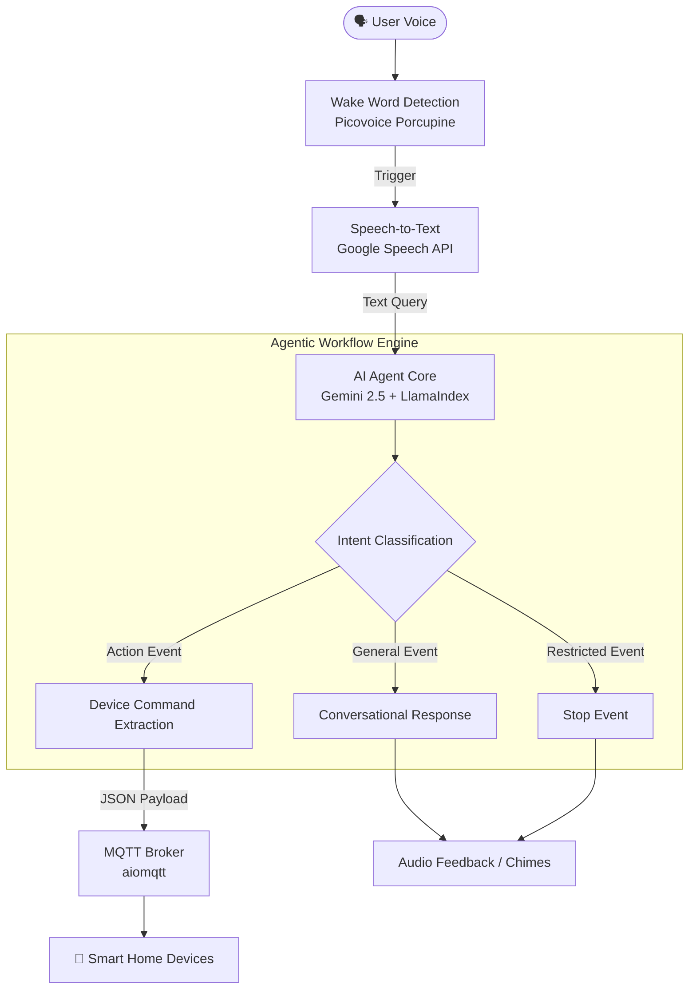
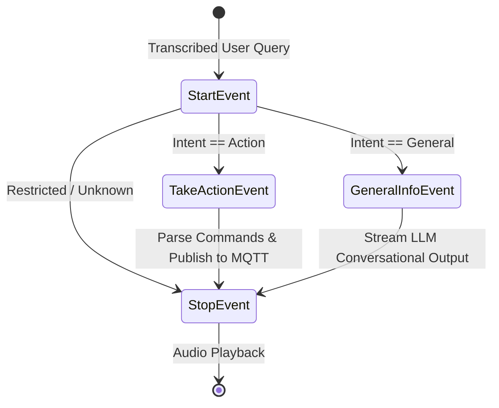

# Building an Intelligent Voice-Controlled IoT Agent: Bridging LLMs, Agentic Workflows, and Smart Homes

As an AI Engineer, one of the most exciting challenges is taking advanced foundation models out of the chat interface and integrating them into the physical world. I recently built a **Voice-Controlled Smart Home Assistant** that seamlessly fuses natural language processing, agentic event-driven workflows, and IoT device management. 

In this technical blog, I’ll walk you through the architecture, the design decisions, and how I leveraged modern AI engineering tools like **Google Gemini 2.5 Flash**, **LlamaIndex Workflows**, **LangChain**, and **MQTT** to create a highly responsive, intelligent home assistant.

---

## 🎯 What Does This Project Do?

At its core, the IoT Agent acts as a centralized "brain" for a smart home. Instead of relying on rigid, hardcoded voice commands (e.g., "Turn on the living room light"), users can interact with their environment naturally:
- *"It's getting a bit dark in the bedroom."*
- *"Can you switch off all the lights on the first floor?"*
- *"What's the weather like today?"*

The system continuously listens for a custom wake word (like "Jarvis" or "Alexa"). Once activated, it transcribes the user's voice, determines the underlying intent using an LLM, and seamlessly routes the execution—either answering a general question or extracting structured device control commands to publish over an MQTT broker.

---

## 🏗️ High-Level System Architecture

To ensure modularity and low latency, I designed the system using an event-driven architecture. Here is a high-level view of how a user's voice command flows through the system:



### The 4 Core Pillars of the Architecture

1. **Continuous Wake Word Detection**: Powered by `pvporcupine`, the agent runs a lightweight, local audio listener that waits for a specific keyword to wake up. This ensures privacy (audio isn't constantly sent to the cloud) and quick activation.
2. **Audio Transcription**: Uses `speech_recognition` to convert the subsequent audio command into text.
3. **Agentic Workflow Engine**: The "Brain" of the operation. Built with `llama_index.core.workflow`, it orchestrates how the parsed text is handled using state events.
4. **IoT Communication**: Asynchronous MQTT publishing via `aiomqtt` to trigger real-world appliances.

---

## 🧠 Deep Dive: The AI Agent Workflow

The standout feature of this project is the **Agentic Workflow Engine**. Instead of a monolithic Python script packed with `if/else` statements, I utilized **LlamaIndex Workflows** to build an event-driven state machine. 

This makes the agent highly robust, scalable, and easy to debug.



### 1. Intent Classification (The Router)
When a `StartEvent` is triggered, the query is passed to **Google Gemini 2.5 Flash** (via LangChain). To ensure the LLM responds reliably, I used **Pydantic Structured Outputs** (`JsonOutputParser`).

The agent strictly classifies the query into one of three boolean flags:
- `action`: The user wants to control a device.
- `general`: The user is asking a conversational or informational question.
- `restricted`: The user is asking something unsafe or out of bounds.

```python
class QueryIntent(BaseModel):
    restricted: bool = Field(description="Sensitive info that may be harmful")
    general: bool = Field(description="Information/knowledge about a topic")
    action: bool = Field(description="Giving an order to do something")
```

### 2. Device Action Extraction
If the intent is an `action`, a `TakeActionEvent` is fired. The LLM is then provided with the user's query and a dynamically loaded YAML registry of the user's smart home devices.

The agent uses a LangChain Prompt Template to map the user's natural language to specific `device_id`s, `location`s, and `state` changes (e.g., "on" or "off"). 

```python
class ApplianceAction(BaseModel):
    device_id: str = Field(description="Identify the device id.")
    device_location: str = Field(description="Identify the device location.")
    state: str = Field(description="Turn device on or off. (on | off)")

class DevicesAction(BaseModel):
    devices: List[ApplianceAction]
    response: str = Field(description="Concise response to the user")
```

Because the LLM guarantees a `DevicesAction` JSON structure, the system can safely iterate through the `devices` list and seamlessly publish the state changes asynchronously to the MQTT broker.

### 3. General Informational Queries
If a `GeneralInfoEvent` is triggered, the system bypasses device execution and streams a conversational response from Gemini. This allows the smart home assistant to act as a standard knowledge assistant (e.g., "What time is it in Tokyo?").

---

## 🔌 Device Management & MQTT Integration

To make the system extensible, devices are not hardcoded. They are managed via a `devices.yaml` registry, validated through Pydantic models. 

```yaml
devices:
  - device_id: bulb-001
    device_name: light bulb
    device_location: bedroom_a
    device_type: light
    mqtt_topic: bedroom
    capabilities:
      - on_off
      - brightness
```

When the LLM identifies that `bulb-001` needs to be turned on, the agent leverages the `aiomqtt` library to asynchronously publish the payload `{"bulb-001": "on"}` to the topic `bedroom`. Using `asyncio.gather`, the agent can concurrently blast state changes to dozens of devices instantly, ensuring zero lag between the voice command and the lights turning on.

---

## 💡 Key AI Engineering Skills Demonstrated

Building this project required a strong blend of AI mechanics and software engineering best practices:

1. **Reliable LLM Orchestration**: Moved beyond basic conversational generation by forcing the LLM to adhere to strict Pydantic JSON schemas (`JsonOutputParser`). This bridges the gap between probabilistic AI and deterministic application logic.
2. **Event-Driven AI Workflows**: Utilized `llama_index.core.workflow` to create a decoupled, state-machine-driven agent. This prevents context bloat and allows for distinct, specialized prompts at each step of the pipeline.
3. **Hardware-Software Integration**: Designed asynchronous MQTT pipelines (`aiomqtt`) capable of handling concurrent network requests for high-performance IoT manipulation.
4. **Security & Guardrails**: Implemented early-exit routing for restricted queries, ensuring the LLM does not execute unsafe commands or respond to prompt injections.

## Conclusion

The IoT Agent project showcases how modern foundation models like Gemini 2.5 Flash, combined with robust orchestration frameworks like LlamaIndex and LangChain, can be integrated into the physical world. By structuring LLM outputs and routing them through asynchronous event loops, we can build smart assistants that are not just conversational, but genuinely functional.

*If you're looking for an AI Engineer who can architect reliable, end-to-end AI systems that bridge software and hardware, let's connect!*
